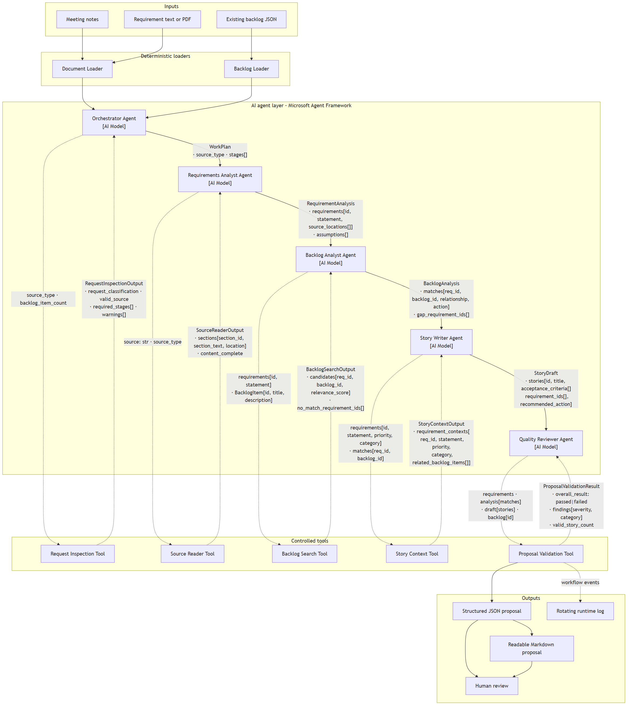

# Smart Backlog Assistant: Project Design

## 1. Executive summary

Smart Backlog Assistant converts engineering meeting notes and requirement
documents into grounded backlog proposals. It uses Microsoft Agent Framework
with five sequential agents and five controlled tools.

The solution:

- extracts requirements from text, Markdown, or text-based PDF sources;
- compares new requirements with an existing backlog;
- recommends whether to reuse, extend, or create backlog work;
- generates user stories and testable acceptance criteria;
- validates traceability, relationships, and tool execution;
- produces JSON and Markdown proposals for human review.

The assistant never publishes or modifies a live backlog. Source documents and
existing backlog records remain authoritative.

## 2. Problem, goals, and boundaries

### 2.1 Problem

Engineering decisions are often captured in unstructured notes, documents, or
PDFs. Converting that material into consistent backlog items is manual and can
lead to:

- missed requirements and constraints;
- vague or untestable stories;
- duplicate backlog items;
- unsupported assumptions;
- inconsistent prioritization and categorization.

### 2.2 MVP goals

The MVP must:

1. summarize the supplied requirements;
2. create clear user stories with testable acceptance criteria;
3. suggest priority and engineering category;
4. identify related or duplicate backlog items;
5. preserve requirement-to-story traceability;
6. expose assumptions and validation findings;
7. require human approval before any downstream backlog action.

### 2.3 Assumptions

- Source material is text, Markdown, or a text-based PDF.
- PDF files contain extractable text; scanned-image OCR is not supported.
- Existing backlog items use stable identifiers and structured fields.
- Priority suggestions use High, Medium, and Low.
- Categories use the supported engineering category allowlist.
- The source document and existing backlog are the authoritative evidence.
- Unclear information is recorded as an assumption or warning, not invented.

### 2.4 Out of scope

- OCR for scanned or image-only documents;
- direct work-tracking platform integration;
- automatic backlog publishing or modification;
- organization-specific approval and estimation rules;
- capacity planning;
- processing confidential material without required organizational controls.

## 3. Solution architecture

The editable Mermaid source is available in
[architecture.mmd](architecture.mmd).

### 3.1 Main components

| Layer | Components | Responsibility |
|---|---|---|
| Inputs | Meeting notes, requirement document, existing backlog JSON | Supply authoritative requirement and backlog evidence |
| Deterministic loaders | Document Loader, Backlog Loader | Validate and normalize source inputs |
| AI agent layer | Five Microsoft Agent Framework agents | Interpret evidence and prepare structured stage outputs |
| Controlled tools | Five request-bound tools | Return authoritative evidence or deterministic validation |
| Guardrails | Limits, allowlists, traceability, exactly-once tool checks | Reject unsupported or unsafe proposals |
| Outputs | JSON proposal, Markdown report, rotating log | Support review, audit, and later integration |
| Human boundary | Reviewer approval | Prevent autonomous backlog modification |

### 3.2 End-to-end flow

1. The Document Loader reads the requirement source.
2. The Backlog Loader reads the existing backlog without modifying it.
3. The Orchestrator Agent validates and classifies the request.
4. The Requirements Analyst Agent extracts grounded requirements.
5. The Backlog Analyst Agent finds relevant existing items.
6. The Story Writer Agent creates proposals from confirmed context.
7. The Quality Reviewer Agent validates the complete proposal.
8. The application writes canonical JSON and reviewer-friendly Markdown.
9. A human reviews the proposal before any backlog action.

### 3.3 AI and deterministic responsibilities

| AI-assisted responsibility | Deterministic responsibility |
|---|---|
| Interpret unstructured requirements | Load and preserve source content |
| Classify requirement intent | Return source sections and locations |
| Explain backlog relationships | Search known backlog records |
| Draft stories and acceptance criteria | Validate identifiers and relationships |
| Improve clarity | Enforce limits and exactly-once tool execution |

AI is not the source of truth for source content, backlog records, identifiers,
or final validation.

## 4. Agent and tool design

The workflow contains exactly five agents.

| Stage | Agent | Controlled tool | Purpose |
|---:|---|---|---|
| 1 | Orchestrator Agent | Request Inspection Tool | Validate the request and determine required stages |
| 2 | Requirements Analyst Agent | Source Reader Tool | Return grounded source sections and extract requirements |
| 3 | Backlog Analyst Agent | Backlog Search Tool | Find candidate backlog items and relevance evidence |
| 4 | Story Writer Agent | Story Context Tool | Prepare grounded context for stories and acceptance criteria |
| 5 | Quality Reviewer Agent | Proposal Validation Tool | Enforce traceability, consistency, and safety guardrails |

Each agent receives one request-bound callable and must invoke it exactly once.
If the model omits, duplicates, or fails the required call, the workflow runs
the same deterministic tool as a fallback and records that execution.

Detailed input, output, validation, and failure contracts are documented in
[Tool Interface Design](TOOL_INTERFACES.md).

### 4.1 Structured handoffs

Agents exchange Pydantic models rather than unrestricted conversation history:

1. request inspection;
2. requirement analysis;
3. backlog analysis;
4. story draft;
5. validated backlog proposal.

This reduces context drift and makes each stage independently testable.

### 4.2 Backlog publishing boundary

The implemented workflow has no publishing tool. A future Backlog Publishing
Tool would require:

- an approved proposal;
- approver identity and approval time;
- a target backlog;
- explicitly confirmed items;
- an audit record of created or updated identifiers.

## 5. Data design

### 5.1 Inputs

| Input | Format | Used by agents? | Purpose |
|---|---|---:|---|
| Meeting notes | UTF-8 text or Markdown | Yes | Capture planning decisions and constraints |
| Requirement document | UTF-8 text, Markdown, or text-based PDF | Yes | Supply formal requirements |
| Existing backlog | JSON | Yes | Support reuse, extension, and new-work decisions |
| Expected backlog | JSON | No | Reviewer-only evaluation reference |
| Scenario manifest | CSV | No | List sample requests and expected decision signals |

`expected_backlog.json` is never passed to the workflow.

### 5.2 Existing backlog contract

The backlog input contains an `items` collection. Each item provides:

- `id`;
- `title`;
- `description`;
- `status`;
- `priority`;
- `category`.

The supplied sample backlog contains one active modernization item:

| ID | Title | Status | Category |
|---|---|---|---|
| `BL-201` | Upgrade the Inventory Application from Angular 9 to Angular 15 | Active | Application Modernization |

### 5.3 Proposal contract

JSON is the canonical output. Its top-level fields are:

| Field | Purpose |
|---|---|
| `correlation_id` | Connect all stages, logs, and tool audit records |
| `summary` | Concise description of the identified work |
| `requirements` | Grounded requirement records with source locations |
| `key_requirements` | Reviewer-friendly requirement statements |
| `stories` | Proposed stories, criteria, categories, and relationships |
| `assumptions` | Information still requiring confirmation |
| `review_notes` | Final validation findings or confirmation |
| `approval_required` | Mandatory human approval marker |
| `tool_invocations` | Exactly-once audit for all five agent tools |

Each requirement contains an identifier, statement, rationale, priority,
category, and source locations. Each story contains requirement identifiers,
acceptance criteria, related backlog identifiers, and relationship evidence.

Generated examples are available under:

- `output/<scenario>/` for deterministic reference runs;
- `output/live/<scenario>/` for provider-backed runs.

### 5.4 Human-readable output

The Markdown report presents the proposal summary, key requirements, stories,
acceptance criteria, assumptions, review notes, and approval requirement. JSON
remains authoritative for automated validation.

## 6. Backlog decision model

The Backlog Analyst Agent and Story Writer Agent use three recommendation
types:

| Relationship | Recommended action | Meaning |
|---|---|---|
| Duplicate | `reuse_existing` | Existing work already covers the requirement |
| Related or partial overlap | `extend_existing` | Existing work covers only part of the requirement |
| No suitable match | `create_new` | The requirement needs a new backlog item |

Every reuse or extension recommendation must reference a known backlog
identifier and include a rationale. New work must not claim a related backlog
identifier.

### 6.1 Expected sample decisions

| Requirement area | Expected decision |
|---|---|
| Angular 9 to Angular 15 modernization | Reuse existing `BL-201` |
| Added accessibility, bundle-size, and Node.js scope | Extend existing `BL-201` |
| Azure Bicep infrastructure | Create new |
| Build and release pipelines | Create new |
| Automated testing | Create new |

## 7. Use cases and evaluation scenarios

### 7.1 Core use cases

#### Convert meeting notes into backlog proposals

The assistant extracts decisions and constraints from planning notes, compares
them with existing work, and produces reviewable stories.

Expected behavior:

- preserve Angular version and deployment-approval constraints;
- reuse existing modernization work where appropriate;
- propose missing infrastructure, pipeline, and testing work;
- retain source traceability.

#### Analyze a requirements document or PDF

The assistant extracts measurable requirements from a formal source.

Expected behavior:

- retain document section or PDF page evidence;
- preserve Azure region, SKU, and environment constraints;
- identify deployment failure handling;
- avoid unsupported infrastructure details.

#### Compare proposed work with an existing backlog

The assistant determines whether requested work is duplicate, related, or new.

Expected behavior:

- return `BL-201` for Angular modernization overlap;
- distinguish added scope from already-covered scope;
- recommend `extend_existing` for partial overlap;
- recommend `create_new` when no valid candidate exists.

### 7.2 Sample scenario set

| Scenario | Source | Primary expected decision |
|---|---|---|
| Meeting modernization | `meeting_notes.txt` | Reuse modernization and create uncovered work |
| Bicep infrastructure | `bicep_requirements.txt` | Create infrastructure and reliability work |
| Modernization extension | `proposed_modernization_extension.txt` | Extend `BL-201` |
| Pipeline requirement | `proposed_pipeline_requirement.txt` | Create DevOps and testing work |
| Security controls | `security_requirements.txt` | Create security work |
| Platform health | `platform_requirements.txt` | Create operations and reliability work |

The complete requests and expected decision signals are listed in
`data/backlog_requests_sample.csv`.

## 8. Prompt, context, and guardrail design

### 8.1 Prompt design

Every agent prompt defines:

1. role and objective;
2. authoritative evidence;
3. required tool and exactly-once instruction;
4. grounding and injection-resistance rules;
5. structured output schema;
6. stage-specific limits.

Executable prompt templates and examples are documented in
[Practical Prompt Engineering](PROMPT_ENGINEERING.md).

### 8.2 Context management

The Requirements Analyst Agent receives grounded source sections. Later stages
receive compact structured models containing only confirmed requirements,
candidate backlog evidence, or story context. The expected evaluation output is
never included in agent context.

### 8.3 Guardrails and safe failure

The workflow validates:

- known requirement and backlog identifiers;
- requirement-to-story coverage;
- relationship and recommendation consistency;
- duplicate identifiers and titles;
- supported priorities and categories;
- requirement, story, criteria, and output limits;
- exactly one required tool call per agent;
- mandatory human approval.

Invalid live output is replaced by a fully deterministic proposal that passes
the same final validation gate. Details are documented in
[MVP Guardrails](GUARDRAILS.md).

### 8.4 Logging and auditability

Every run records:

- workflow correlation identifier;
- agent-stage progress;
- model or fallback tool execution;
- validation failures;
- written output paths.

Logs are written to `logs/smart_backlog_assistant.log` with rotation enabled.
Provider credentials are not logged.

## 9. Quality attributes

| Attribute | Design response |
|---|---|
| Grounding | Tools return source and backlog evidence |
| Traceability | Requirements retain source locations and story links |
| Reliability | Deterministic fallback and final validation protect outputs |
| Auditability | Correlation IDs, tool records, and rotating logs |
| Safety | Read-only backlog handling and mandatory human approval |
| Maintainability | Layered package structure and typed stage contracts |
| Testability | Deterministic tools and schema-constrained handoffs |

## 10. Design trade-offs

- Focused agents improve traceability but add orchestration overhead.
- Structured handoffs improve consistency but reduce free-form flexibility.
- Token-overlap matching is transparent and deterministic but less semantic
  than an embedding or domain-specific search.
- Strict guardrails may reject useful model wording changes, but they prevent
  unsupported output from reaching reviewers.
- Human approval increases confidence but intentionally prevents autonomous
  backlog creation.

## 11. Future improvements

1. Add organization-specific priority and categorization rules.
2. Improve matching for larger and specialized backlogs.
3. Add approved work-tracking platform integration.
4. Add an approval-gated Backlog Publishing Tool.
5. Add optional OCR for scanned documents.
6. Add richer operational metrics and workflow dashboards.

## 12. Design evidence map

| Design requirement | Evidence |
|---|---|
| Problem and success criteria | Sections 2.1 and 2.2 |
| Main solution components | Section 3.1 and architecture diagram |
| End-to-end data flow | Section 3.2 |
| Five-agent design | Section 4 |
| Controlled tool usage | Sections 4 and 8.3 |
| Input and output contracts | Section 5 |
| Reuse, extension, and creation decisions | Section 6 |
| Sample requests and expected behavior | Section 7 |
| Prompt and context strategy | Sections 8.1 and 8.2 |
| Reliability and safety controls | Sections 8.3, 8.4, and 9 |
| Human approval boundary | Sections 2.2, 3.2, and 4.2 |
