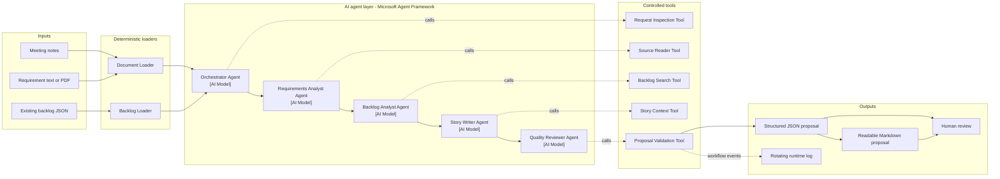

# Smart Backlog Assistant: Problem and Design

## Problem definition

Engineering teams often leave meetings with useful decisions captured in
unstructured notes, documents, or PDFs. Turning that material into consistent
backlog items is manual, and existing backlog entries are easily duplicated or
overlooked.

The Smart Backlog Assistant creates a reviewed backlog proposal containing:

- a concise requirements summary;
- user stories with descriptions and acceptance criteria;
- suggested priority and category;
- relationships with existing backlog items;
- warnings when requirements are unclear or potentially duplicated.

The assistant proposes work; it does not automatically modify a real backlog.
A person reviews the result before using it in a work-tracking system.

## Assumptions

- Source material is provided as text, Markdown, or a text-based PDF.
- PDF files contain extractable text; scanned-image OCR is outside the initial
  scope.
- Existing backlog items are supplied in a simple structured format.
- Each backlog item has a stable identifier, title, description, status,
  priority, and category.
- Priority suggestions use High, Medium, and Low unless an organization-specific
  scale is provided later.
- Categories are suggested from common engineering themes such as application
  modernization, infrastructure, DevOps, testing, feature, security,
  reliability, performance, and operations.
- Generated stories are proposals and require human review.
- The assistant does not create, update, close, or reprioritize real backlog
  items.
- The source document and backlog are considered the authoritative evidence for
  the proposal.
- When information is unclear, the assistant records an assumption or warning
  rather than inventing details.

## Out of scope for the initial solution

- OCR for scanned or image-only documents;
- direct connection to a live work-tracking platform;
- automatic publishing or modification of backlog items;
- organization-specific approval workflows;
- custom priority, estimation, or capacity-planning rules;
- processing confidential material without the required organizational
  security controls.

## MVP success criteria

A successful MVP:

1. summarizes the source requirements;
2. creates clear and testable stories;
3. suggests priority and category;
4. references relevant existing backlog identifiers;
5. highlights assumptions or unclear information;
6. produces a proposal for human review rather than automatic publishing.

## MVP data formats

### Requirement source input

| Input | Format | Notes |
|---|---|---|
| Meeting notes | UTF-8 text or Markdown | Free-form notes with no required template |
| Requirement document | UTF-8 text, Markdown, or text-based PDF | PDF evidence should retain page information |

### Existing backlog input

The existing backlog uses JSON with one `items` collection. Each item contains:

- `id`;
- `title`;
- `description`;
- `status`;
- `priority`;
- `category`.

The backlog is reference data representing work that already exists before the
new prompt is received. It is not a predefined answer or expected output.

### Backlog proposal output

JSON is the canonical output because it can be validated and used by another
system later. The proposal contains:

- a workflow correlation identifier;
- source information;
- requirements summary;
- identified requirements and supporting locations;
- proposed user stories;
- acceptance criteria;
- priority and category;
- relationships with existing backlog items;
- review findings;
- a mandatory human-approval marker;
- an audit of the five required agent tool calls.

A relationship contains the existing backlog identifier, whether it is a
duplicate or related item, a short explanation, and a recommended action:

- `reuse_existing` when the requirement is already covered;
- `extend_existing` when an existing item covers only part of the requirement;
- `create_new` when no suitable item exists.

```json
{
  "correlation_id": "00000000-0000-0000-0000-000000000001",
  "summary": "Modernize and automate delivery of the Inventory Application.",
  "requirements": [
    {
      "id": "REQ-001",
      "statement": "Upgrade Angular 9 to Angular 15.",
      "rationale": "Identified directly from the supplied source.",
      "priority": "High",
      "category": "Application Modernization",
      "source_locations": ["Text block 2"]
    }
  ],
  "key_requirements": ["Upgrade Angular 9 to Angular 15."],
  "stories": [
    {
      "id": "STORY-001",
      "title": "Upgrade the Inventory Application to Angular 15",
      "description": "Upgrade the application while preserving existing inventory workflows.",
      "acceptance_criteria": [
        "The application uses Angular 15 and supported dependencies.",
        "Critical inventory workflows pass regression testing."
      ],
      "priority": "High",
      "category": "Application Modernization",
      "requirement_ids": ["REQ-001"],
      "related_backlog_ids": ["BL-201"],
      "backlog_relationships": [
        {
          "requirement_id": "REQ-001",
          "backlog_id": "BL-201",
          "relationship": "duplicate",
          "rationale": "The existing item covers the same Angular upgrade.",
          "recommended_action": "reuse_existing"
        }
      ]
    }
  ],
  "assumptions": [],
  "review_notes": ["Proposal passed deterministic structure checks."],
  "approval_required": true,
  "tool_invocations": [
    {
      "correlation_id": "00000000-0000-0000-0000-000000000001",
      "agent": "Orchestrator Agent",
      "tool": "request_inspection",
      "call_count": 1,
      "execution": "model"
    },
    {
      "correlation_id": "00000000-0000-0000-0000-000000000001",
      "agent": "Requirements Analyst Agent",
      "tool": "source_reader",
      "call_count": 1,
      "execution": "model"
    },
    {
      "correlation_id": "00000000-0000-0000-0000-000000000001",
      "agent": "Backlog Analyst Agent",
      "tool": "backlog_search",
      "call_count": 1,
      "execution": "model"
    },
    {
      "correlation_id": "00000000-0000-0000-0000-000000000001",
      "agent": "Story Writer Agent",
      "tool": "story_context",
      "call_count": 1,
      "execution": "model"
    },
    {
      "correlation_id": "00000000-0000-0000-0000-000000000001",
      "agent": "Quality Reviewer Agent",
      "tool": "proposal_validation",
      "call_count": 1,
      "execution": "model"
    }
  ]
}
```

### Human-readable output

The same proposal may also be presented as Markdown for reviewer convenience.
The JSON remains the authoritative structured result, while Markdown is a
readable representation.

## Sample existing backlog

The agents receive an existing backlog containing only the Angular
modernization item:

```json
{
  "items": [
    {
      "id": "BL-201",
      "title": "Upgrade the Inventory Application from Angular 9 to Angular 15",
      "description": "Upgrade Angular and related dependencies, resolve compatibility issues, and confirm that existing inventory features continue to work.",
      "status": "Active",
      "priority": "High",
      "category": "Application Modernization"
    }
  ]
}
```

The expected evaluation result contains the existing item plus three proposed
additions:

| Expected result | Recommended action |
|---|---|
| Angular 9 to Angular 15 modernization | Reuse existing `BL-201` |
| Azure Bicep infrastructure with region and SKU settings | Create new |
| Build and release pipelines | Create new |
| Automated testing | Create new |

The complete input and evaluation reference are stored separately as
`existing_backlog.json` and `expected_backlog.json`. Only the existing backlog
is supplied to the agents.

## Use cases

### 1. Convert meeting notes into user stories

An engineering lead supplies notes from a planning meeting. The assistant
extracts decisions and constraints, identifies the intended users, and creates
reviewable user stories.

### 2. Process a requirements document or PDF

A product manager supplies a requirements document. The assistant summarizes
the key requirements and proposes stories with testable acceptance criteria,
priorities, and categories.

### 3. Compare proposed work with an existing backlog

The assistant compares new requirements with existing backlog items and labels
them as new work, related work, or possible duplicates.

## Sample for each use case

### Sample 1: Meeting notes to proposed user stories

**Example input**

> The Inventory Application must be upgraded from Angular 9 to Angular 15.
> Related dependencies must be updated, and existing inventory workflows must
> continue to work. The team also needs automated build and release pipelines.
> Every build should run automated tests, and production deployment should
> require approval.

**Expected outcome**

- identify the Angular upgrade, dependency compatibility, pipeline, testing,
  and approval requirements;
- recommend reusing the existing modernization item;
- propose new infrastructure, pipeline, and testing stories;
- preserve the Angular 9 to Angular 15 constraint;
- include acceptance criteria for successful builds, tests, and production
  approval;
- relate the proposed work to existing backlog items where applicable.

### Sample 2: Requirement document or PDF analysis

The following content may be supplied as a text document or a text-based PDF.

**Example input**

> The Inventory Application infrastructure must be deployed in Azure using
> reusable Bicep templates. The same templates must support development, test,
> and production environments through environment-specific settings. Each
> environment must define its Azure region and SKU size without changing the
> shared template. Deployment failures must be reported clearly and must not
> leave partially configured resources.

**Expected outcome**

- summarize the infrastructure-as-code requirement;
- identify reusable templates, multiple environments, Azure region, and SKU
  size as constraints;
- propose an infrastructure story with testable deployment criteria;
- categorize the work as Infrastructure;
- identify failure handling as a reliability requirement;
- include acceptance criteria confirming that region and SKU can be configured
  independently for each environment;
- retain the document section or PDF page as supporting evidence.

### Sample 3: Compare proposed work with an existing backlog

**Proposed requirement**

> Extend the existing Inventory Application Angular 15 upgrade to include
> automated bundle-size analysis, WCAG accessibility checks, and Node.js 20
> build compatibility.

**Relevant existing backlog item**

| ID | Title | Status |
|---|---|---|
| BL-201 | Upgrade the Inventory Application from Angular 9 to Angular 15 | Active |

**Expected outcome**

- return `BL-201` as a strong candidate;
- recognize the existing Angular modernization scope;
- identify bundle analysis, accessibility, and Node.js compatibility as added
  requirements;
- classify the relationship as related rather than duplicate;
- recommend `extend_existing`.

## What the agents do after receiving a prompt

The source prompt and the existing backlog have different purposes:

- the prompt describes new needs, decisions, or proposed work;
- the backlog describes work that already exists;
- the agent workflow compares them and produces a recommendation.

### Meeting-notes use case

1. The Orchestrator Agent recognizes that requirements extraction, backlog comparison,
   story writing, and review are required.
2. The Requirements Analyst Agent extracts the Angular upgrade, Bicep, pipeline,
   testing, Azure region, SKU, and approval requirements.
3. The Backlog Analyst Agent searches the existing backlog for each requirement.
4. The Story Writer Agent recommends reusing a duplicate item, extending related work,
   or creating a new story for uncovered requirements.
5. The Quality Reviewer Agent checks that every recommendation is supported by the
   meeting notes and backlog evidence.

### Requirement-document or PDF use case

1. The Source Reader returns the relevant document sections and PDF page
   locations.
2. The Requirements Analyst Agent identifies measurable constraints such as Azure
   region, SKU size, supported environments, and deployment safety.
3. The Backlog Analyst Agent checks whether the infrastructure work already exists.
4. The Story Writer Agent creates only the missing or extended work and retains source
   traceability.
5. The Quality Reviewer Agent verifies that no unsupported infrastructure details were
   added.

### Backlog-comparison use case

1. The modernization extension is compared with existing item
   `BL-201`.
2. The shared Angular modernization scope establishes a valid relationship.
3. The added accessibility, bundle analysis, and Node.js requirements result in
   `extend_existing`.
4. The Bicep, pipeline, and testing requirements have no matching existing
   items, so the result recommends `create_new`.
5. The final proposal explains the decision rather than silently creating a
   duplicate item.

## Agent design

| Agent | Responsibility | Controlled tool | Tool result |
|---|---|---|---|
| Orchestrator Agent | Understand the request and plan the work | Request Inspection Tool | Source type, document size, backlog availability, and required stages |
| Requirements Analyst Agent | Identify goals, users, constraints, and requirements | Source Reader Tool | Grounded text sections with source and location information |
| Backlog Analyst Agent | Compare requirements with current backlog items | Backlog Search Tool | Candidate items with identifiers, status, category, and relevance evidence |
| Story Writer Agent | Create user stories and acceptance criteria | Story Context Tool | Confirmed requirement, related items, constraints, and priority evidence |
| Quality Reviewer Agent | Check grounding, clarity, duplication, and testability | Proposal Validation Tool | Validation findings, unsupported references, duplicate warnings, and missing information |

Each stage receives a compact structured summary from the previous stage rather
than the complete conversation history.

## Tool-call design

Tools provide authoritative information or deterministic validation. Agents use
that evidence to interpret requirements and write clear outputs, but they do not
invent source content or directly change the backlog.

### Orchestrator Agent

The orchestrator must call the Request Inspection Tool before creating its plan.
The tool confirms what inputs are available and prevents the agent from planning
stages for missing data.

### Requirements Analyst Agent

The requirements analyst calls the Source Reader Tool to retrieve source
sections. For a PDF, the result should retain page information. For a long
document, the tool may return only sections relevant to the current analysis.

### Backlog Analyst Agent

The backlog analyst calls the Backlog Search Tool for each confirmed
requirement. The tool returns candidate items and evidence, while the agent
decides whether each candidate is a duplicate, related work, or not relevant.

### Story Writer Agent

The story writer calls the Story Context Tool before drafting stories. This
ensures that it uses confirmed requirements, known constraints, and backlog
relationships rather than relying on conversation memory.

### Quality Reviewer Agent

The reviewer calls the Proposal Validation Tool. The tool checks required
information, duplicate titles, invalid backlog references, and acceptance
criteria completeness. The reviewer then corrects wording without introducing
new scope.

### Backlog updates

The initial solution intentionally has no tool that directly creates or edits
backlog items. The output is a proposal for human review. A future Backlog
Publishing Tool should require explicit approval and record who approved the
change.

Detailed inputs, outputs, validation rules, and failure conditions are defined
in [Tool Interface Design](TOOL_INTERFACES.md).

## Architecture

The architecture separates deterministic data handling and validation from AI
interpretation and generation.




### Main components

- input documents and the existing backlog;
- deterministic document and backlog loaders;
- five AI agents;
- five controlled tools;
- structured and human-readable outputs;
- human review before any backlog change.

### Data flow

1. The loaders read the source document and existing backlog.
2. The Orchestrator Agent plans the required stages.
3. Worker agents receive compact structured summaries in sequence.
4. Each agent calls its controlled tool for evidence or validation.
5. The Quality Reviewer Agent produces the final proposal.
6. The structured proposal and readable report are presented for human review.

The runtime binds one request-specific callable to each Agent Framework agent.
The output records whether the model invoked the tool or the deterministic
fallback enforced the required call.

### Where AI is used

AI is used to interpret unstructured requirements, classify relationships,
write user stories and acceptance criteria, recommend priority and category,
and review the proposal for clarity.

AI is not used as the source of truth for document content, backlog records, or
validation rules. Those responsibilities remain in the deterministic layer.

The executable validation and failure-safety controls are documented in
[MVP Guardrails](GUARDRAILS.md).

## Solution design requirement coverage

| Required design evidence | Where it is documented |
|---|---|
| Main solution components | Architecture diagram and Main components section |
| Data flow through the system | Architecture arrows and Data flow section |
| Where AI is used | AI agent layer and Where AI is used section |
| Prompt-design approach | Prompt design principles and agent-specific prompt sections |
| AI assistance during design | AI use during development section |

## Prompt design principles

The executable prompt templates and worked examples are documented in
[Practical Prompt Engineering](PROMPT_ENGINEERING.md).

Every agent receives:

1. a clear role and goal;
2. only the information needed for its task;
3. instructions to call its required tool before responding;
4. instructions not to invent unsupported requirements;
5. a defined structure for its response.

The final reviewer checks that stories remain grounded in the source and that
acceptance criteria describe observable outcomes.

### Requirements Analyst Agent prompt

The Requirements Analyst Agent is instructed to identify only requirements supported
by the Source Reader Tool, preserve measurable constraints, and separate
assumptions from confirmed needs.

### Backlog Analyst Agent prompt

The Backlog Analyst Agent distinguishes between a duplicate with substantially the
same intent, related work with partial overlap, and a gap representing new work.
It bases the comparison on candidates returned by the Backlog Search Tool.

### Story Writer Agent prompt

The Story Writer Agent creates concise user stories grounded in the confirmed
information returned by the Story Context Tool. Acceptance criteria must
describe behavior that can be observed and tested.

### Quality Reviewer Agent prompt

The Quality Reviewer Agent checks for unsupported details, vague descriptions,
duplicate stories, inconsistent priority or category, and acceptance criteria
that cannot be verified. It uses validation findings to improve wording without
introducing new scope.

### Context management

The original document is used during requirements analysis. Later stages
receive compact structured summary objects containing only the information they
need. For large documents, a future version could retrieve only the most
relevant sections before requirements analysis.

## AI use during development

AI assistance was used to refine the problem statement, compare possible agent
roles, improve prompt wording, and identify realistic evaluation scenarios.
The final requirements, design decisions, and outputs were reviewed by a
person.

## Design trade-offs

- Focused agents improve traceability but require more coordination.
- Structured handoffs improve consistency but reduce free-form flexibility.
- Comparing against a larger backlog may improve coverage but can also add
  irrelevant matches.
- Human review increases confidence but prevents fully autonomous backlog
  creation.

## Future improvements

1. Add organization-specific priority and categorization rules.
2. Improve comparison for larger and more specialized backlogs.
3. Add direct integration with a work-tracking platform.
4. Require approval before creating or changing backlog items.
