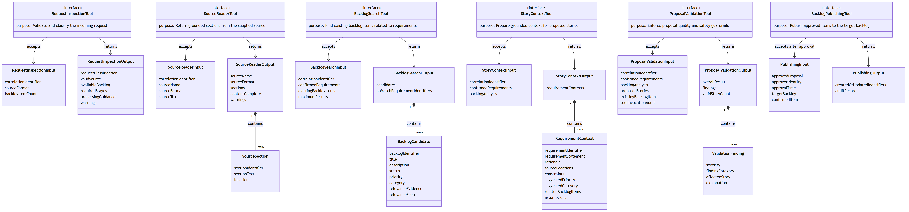

# Tool Interface Design

The tools provide controlled access to source material, backlog information, and
validation rules. Each tool returns structured evidence that an agent can use
without relying on conversation memory.

## Interface and data-object diagram

The following logical class diagram represents each tool as an interface
with a separate input and output object. Collection outputs are expanded to show
the objects they contain.

Select the diagram to open the full-resolution image.

The Mermaid definition is retained below as an editable diagram source.

```mermaid
classDiagram
    class RequestInspectionTool {
        <<interface>>
        purpose: Validate and classify the incoming request
    }
    class RequestInspectionInput {
        correlationIdentifier
        sourceFormat
        backlogItemCount
    }
    class RequestInspectionOutput {
        requestClassification
        validSource
        availableBacklog
        requiredStages
        processingGuidance
        warnings
    }
    RequestInspectionTool --> RequestInspectionInput : accepts
    RequestInspectionTool --> RequestInspectionOutput : returns

    class SourceReaderTool {
        <<interface>>
        purpose: Return grounded sections from the supplied source
    }
    class SourceReaderInput {
        correlationIdentifier
        sourceName
        sourceFormat
        sourceText
    }
    class SourceReaderOutput {
        sourceName
        sourceFormat
        sections
        contentComplete
        warnings
    }
    class SourceSection {
        sectionIdentifier
        sectionText
        location
    }
    SourceReaderTool --> SourceReaderInput : accepts
    SourceReaderTool --> SourceReaderOutput : returns
    SourceReaderOutput "1" *-- "many" SourceSection : contains

    class BacklogSearchTool {
        <<interface>>
        purpose: Find existing backlog items related to requirements
    }
    class BacklogSearchInput {
        correlationIdentifier
        confirmedRequirements
        existingBacklogItems
        maximumResults
    }
    class BacklogSearchOutput {
        candidates
        noMatchRequirementIdentifiers
    }
    class BacklogCandidate {
        backlogIdentifier
        title
        description
        status
        priority
        category
        relevanceEvidence
        relevanceScore
    }
    BacklogSearchTool --> BacklogSearchInput : accepts
    BacklogSearchTool --> BacklogSearchOutput : returns
    BacklogSearchOutput "1" *-- "many" BacklogCandidate : contains

    class StoryContextTool {
        <<interface>>
        purpose: Prepare grounded context for proposed stories
    }
    class StoryContextInput {
        correlationIdentifier
        confirmedRequirements
        backlogAnalysis
    }
    class StoryContextOutput {
        requirementContexts
    }
    class RequirementContext {
        requirementIdentifier
        requirementStatement
        rationale
        sourceLocations
        constraints
        suggestedPriority
        suggestedCategory
        relatedBacklogItems
        assumptions
    }
    StoryContextTool --> StoryContextInput : accepts
    StoryContextTool --> StoryContextOutput : returns
    StoryContextOutput "1" *-- "many" RequirementContext : contains

    class ProposalValidationTool {
        <<interface>>
        purpose: Enforce proposal quality and safety guardrails
    }
    class ProposalValidationInput {
        correlationIdentifier
        confirmedRequirements
        backlogAnalysis
        proposedStories
        existingBacklogItems
        toolInvocationAudit
    }
    class ProposalValidationOutput {
        overallResult
        findings
        validStoryCount
    }
    class ValidationFinding {
        severity
        findingCategory
        affectedStory
        explanation
    }
    ProposalValidationTool --> ProposalValidationInput : accepts
    ProposalValidationTool --> ProposalValidationOutput : returns
    ProposalValidationOutput "1" *-- "many" ValidationFinding : contains

    class BacklogPublishingTool {
        <<interface>>
        purpose: Publish approved items to the target backlog
    }
    class PublishingInput {
        approvedProposal
        approverIdentity
        approvalTime
        targetBacklog
        confirmedItems
    }
    class PublishingOutput {
        createdOrUpdatedIdentifiers
        auditRecord
    }
    BacklogPublishingTool --> PublishingInput : accepts after approval
    BacklogPublishingTool --> PublishingOutput : returns
```

The complete diagram, including the future approval-gated publishing interface,
is available in
[tool_interface_diagram.mmd](tool_interface_diagram.mmd).

## Common interface principles

- Every request includes a correlation identifier for traceability.
- Each Agent Framework agent receives one request-bound callable and must invoke
  it exactly once.
- The runtime wrapper closes over the validated logical input shown below, so
  the model cannot replace identifiers or source references with arbitrary
  arguments.
- If the model omits a required call, the workflow invokes the same
  deterministic tool directly and records fallback execution.
- Required information is validated before the tool performs its work.
- Tools return evidence and warnings rather than hiding missing information.
- Read tools do not change the source document or backlog.
- Tool failures are returned clearly to the calling agent and recorded for
  monitoring.

## 1. Request Inspection Tool

**Used by:** Orchestrator Agent

**Purpose:** Confirm the available inputs and determine which workflow stages
are needed.

**Implementation:** `application/tools/request_inspection.py`

### Input

| Information | Required | Description |
|---|---:|---|
| Correlation identifier | Yes | Identifies the complete workflow request |
| Source format | Yes | Text, Markdown, or PDF |
| Backlog item count | Yes | Number of available existing backlog items |

### Output

| Information | Description |
|---|---|
| Request classification | Meeting notes, requirement document, or unsupported input |
| Valid source | Whether the source can be processed |
| Available backlog | Whether backlog comparison can be performed |
| Required stages | Ordered list of agents that should run |
| Processing guidance | Any limits or special handling required |
| Warnings | Missing backlog, large document, or unsupported request details |

### Failure conditions

- the source is missing;
- the source format is unsupported;
- the source contains no readable content;
- backlog comparison was requested but backlog data is invalid.

## 2. Source Reader Tool

**Used by:** Requirements Analyst Agent

**Purpose:** Return grounded sections from the supplied meeting notes or
requirements document.

**Implementation:** `application/tools/source_reader.py`

### Input

| Information | Required | Description |
|---|---:|---|
| Correlation identifier | Yes | Links the read operation to the workflow |
| Source name | Yes | Identifies the supplied document |
| Source format | Yes | Text or PDF |
| Source text | Yes | Validated source content loaded by the deterministic loader |

### Output

| Information | Description |
|---|---|
| Source name | Document from which the evidence was retrieved |
| Source format | Text, Markdown, or PDF |
| Sections | Ordered source sections returned for analysis |
| Section identifier | Stable identifier for each section |
| Section text | Extracted source content |
| Location | Heading, paragraph, or PDF page number |
| Content complete | Whether all requested content was returned |
| Warnings | Unreadable page, missing text, or truncated content |

### Failure conditions

- the document cannot be opened;
- a PDF page cannot be read;
- no text can be extracted;
- the requested section does not exist.

## 3. Backlog Search Tool

**Used by:** Backlog Analyst Agent

**Purpose:** Find existing backlog items that may overlap with a confirmed
requirement.

**Implementation:** `application/tools/backlog_search.py`

### Input

| Information | Required | Description |
|---|---:|---|
| Correlation identifier | Yes | Links the search to the workflow |
| Confirmed requirements | Yes | Complete validated Requirement Analysis |
| Existing backlog items | Yes | Read-only backlog records supplied to the workflow |
| Maximum results | No | Limits the number of candidates returned |

### Output

| Information | Description |
|---|---|
| Candidates | Existing backlog items that may be relevant to each requirement |
| Requirement identifier | Requirement associated with each candidate |
| Backlog identifier | Stable identifier of each candidate |
| Title and description | Existing item content |
| Status | Current backlog state |
| Priority and category | Existing classification |
| Relevance evidence | Terms or meaning that caused the match |
| Relevance score | Relative strength of the match |
| No-match requirement identifiers | Requirements for which no candidates were found |

### Failure conditions

- the requirement identifier or statement is missing;
- the backlog is unavailable or invalid;
- the configured result limit is invalid;
- the search operation cannot complete.

The tool returns candidates only. The agent decides whether a candidate is a
duplicate, related work, or not relevant.

## 4. Story Context Tool

**Used by:** Story Writer Agent

**Purpose:** Assemble approved evidence for story creation without asking the
writer to reconstruct context from earlier messages.

**Implementation:** `application/tools/story_context.py`

### Input

| Information | Required | Description |
|---|---:|---|
| Correlation identifier | Yes | Links the context request to the workflow |
| Confirmed requirements | Yes | Validated Requirement Analysis |
| Backlog analysis | Yes | Duplicate, related, and gap decisions |

### Output

For each requirement, the tool returns:

| Information | Description |
|---|---|
| Requirement identifier | Stable requirement reference |
| Requirement statement | Confirmed requirement text |
| Rationale | Why the requirement was identified |
| Source locations | Sections or pages supporting the requirement |
| Constraints | Dates, limits, security rules, or performance targets |
| Suggested priority | Priority supported by the available evidence |
| Suggested category | Proposed classification |
| Related backlog items | Existing item identifiers and relationships |
| Assumptions | Information that still requires confirmation |

### Failure conditions

- a requested requirement does not exist;
- requirement evidence is incomplete;
- a related backlog reference is invalid;
- no requirements were requested.

## 5. Proposal Validation Tool

**Used by:** Quality Reviewer Agent

**Purpose:** Apply deterministic quality and traceability checks before the
proposal is presented for human review.

**Implementation:** `application/tools/proposal_validation.py`. The Quality
Reviewer Agent invokes it for draft findings, and the workflow invokes the same
validator as the final blocking gate before writing output.

### Input

| Information | Required | Description |
|---|---:|---|
| Correlation identifier | Yes | Links validation to the workflow |
| Confirmed requirements | Yes | Authoritative requirements and source locations |
| Backlog analysis | Yes | Authoritative relationship decisions |
| Proposed stories | Yes | Draft or final stories submitted for validation |
| Existing backlog items | Yes | Valid read-only backlog references |
| Tool invocation audit | Final validation | Correlated exactly-once records for all five tools |

Each proposed story includes its identifier, title, description, acceptance
criteria, priority, category, requirement references, and related backlog
references. It also includes the recommended action: reuse an existing item,
extend related work, or create new work.

### Output

| Information | Description |
|---|---|
| Overall result | Passed, passed with warnings, or failed |
| Findings | List of quality or traceability issues |
| Severity | Warning or error |
| Finding category | Missing information, duplicate, grounding, reference, or testability |
| Affected story | Story associated with the finding |
| Explanation | Clear reason for the finding |
| Valid story count | Number of stories without blocking findings |

### Validation checks

- required story information is present;
- every story maps to a known requirement;
- related backlog identifiers exist;
- titles are not duplicated;
- descriptions remain grounded in the source;
- acceptance criteria are observable and testable;
- priority and category values are consistent;
- the recommended action is valid and supported by the backlog relationship;
- unsupported facts or scope are flagged.

### Failure conditions

- the proposal is empty;
- the proposal structure is incomplete;
- requirement or backlog references cannot be validated;
- validation rules cannot be applied.

The tool reports findings but does not rewrite the proposal. The Quality
Reviewer uses the findings to correct the final response.

## Future Backlog Publishing Tool

The initial solution stops at a reviewed proposal. A future publishing tool
would require:

- an approved proposal;
- the approver's identity;
- the approval time;
- the target project and backlog;
- confirmation of the items to create or update.

It would return created or updated backlog identifiers and an audit record.
Publishing should not proceed without explicit human approval.
