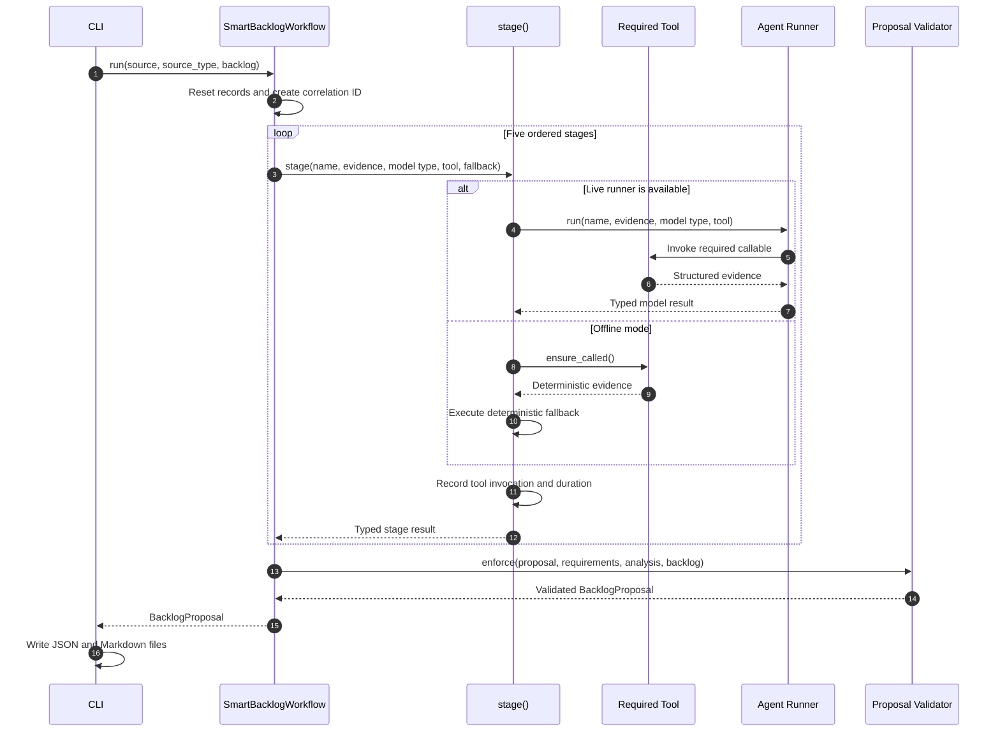
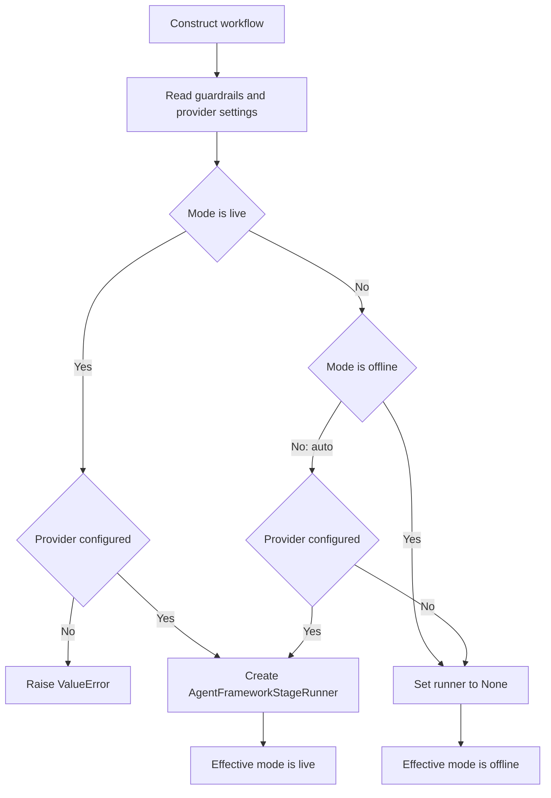
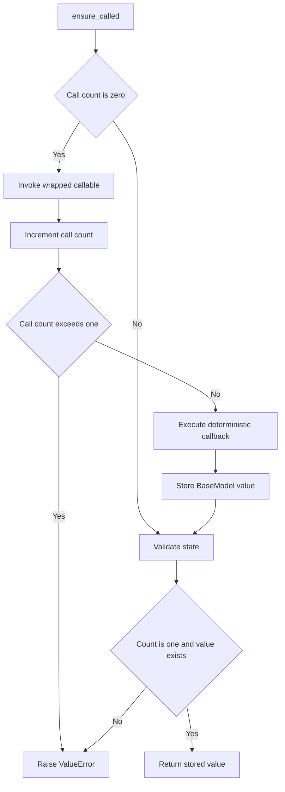

## Purpose

`application/workflow.py` coordinates the conversion of source requirements
and an existing backlog into a validated `BacklogProposal`. It supports two
execution paths:

* Offline mode uses deterministic Python functions at every stage
* Live mode asks an AI agent to produce each typed result and uses the
  deterministic implementation when an expected model failure occurs

Both paths use the same evidence tools, Pydantic contracts, final guardrails,
logging, correlation identifier, and exactly-once tool-call records.

## Main types

| Python type | Responsibility | Approximate C# equivalent |
|---|---|---|
| `SmartBacklogWorkflow` | Coordinates the complete use case | Application service |
| `BacklogItem` | Represents an existing backlog item | DTO or record |
| `WorkPlan` | Describes the required processing stages | Planning DTO |
| `RequirementAnalysis` | Contains grounded requirements | Analysis result record |
| `BacklogAnalysis` | Contains matches and requirement gaps | Analysis result record |
| `StoryDraft` | Contains generated user stories | Draft aggregate |
| `BacklogProposal` | Represents the final output | Response DTO |
| `RequiredToolBinding` | Wraps and tracks one callback | Delegate wrapper |
| `AgentFrameworkStageRunner` | Invokes an AI agent in live mode | AI service adapter |

The Pydantic models act like C# records combined with runtime schema
validation. Calls such as `WorkPlan.model_validate(value)` are comparable to
deserializing data into a C# model and validating its required fields.

## End-to-end sequence



## Execution mode selection

The constructor reads guardrail settings and provider configuration. Its mode
selection can be represented as follows:



`auto` therefore means live execution when provider settings are available and
offline execution otherwise. Explicit `offline` mode never creates an agent
runner, even when credentials are configured.

## The run method

`run()` is the workflow's application-service entry point. In C# terms, its
signature is similar to:

```csharp
Task<BacklogProposal> RunAsync(
    string source,
    SourceType sourceType,
    IReadOnlyList<BacklogItem> backlog);
```

### Initialize request state

The method clears records left by a previous invocation, creates a UUID
correlation identifier, starts a timer, and logs bounded metadata. Source text
and model content are not included in these process log messages.

### Stage 1: inspect the request

`RequestInspectionTool.inspect()` receives the source type and backlog count.
It returns the authoritative list of stages. The result becomes a `WorkPlan`.

The callback:

```python
lambda: RequestInspectionTool().inspect(source_type, len(backlog))
```

is comparable to this C# delegate:

```csharp
() => new RequestInspectionTool().Inspect(sourceType, backlog.Count)
```

The lambda stores work to execute later. Creating the lambda does not call the
tool.

### Stage 2: extract grounded requirements

`SourceReaderTool.read()` divides the normalized source into evidence sections.
The requirements stage returns `RequirementAnalysis`.

Offline execution calls `deterministic_requirements_from_reader()`. It splits
the source into candidate statements, selects requirement-like statements,
deduplicates them, applies configured limits, and assigns deterministic
categories and priorities.

`ground_requirements_from_reader()` then checks that every requirement
statement occurs in authoritative source evidence. In offline mode, an
ungrounded statement raises `ValueError`. In live mode, the workflow replaces
ungrounded model output with deterministic requirements.

### Stage 3: compare the backlog

`BacklogSearchTool.search()` searches existing items for every requirement.
The stage produces `BacklogAnalysis`, which contains:

* Related or duplicate backlog matches
* Requirement identifiers with no match
* A recommendation to reuse or extend matching work

The deterministic conversion selects the candidate with the highest relevance
score. A score of at least `0.30` is treated as a duplicate; a lower accepted
score is treated as related work.

### Stage 4: write stories

`StoryContextTool.assemble()` combines requirement evidence with backlog
relationships. The writer stage returns `StoryDraft`.

`deterministic_stories()` creates one story per requirement. Each story includes
a title, description, two acceptance criteria, priority, category, requirement
traceability, backlog relationships, and one of these actions:

* `reuse_existing` when a duplicate exists
* `extend_existing` when related work exists
* `create_new` when no match exists

### Stage 5: review the proposal

`ProposalValidationTool.review_draft()` supplies deterministic validation
evidence to the reviewer. The stage returns `BacklogProposal`.

The offline reviewer calls `deterministic_review()`. It removes stories with
duplicate titles and ensures each retained story has at least two acceptance
criteria. The proposal remains approval-gated.

### Enforce final guardrails

The method adds the correlation identifier and tool invocation records to the
proposal. `validator.enforce()` then verifies the complete proposal against the
requirements, backlog analysis, and existing backlog.

If final enforcement succeeds, `run()` logs summary metrics and returns the
validated proposal. If AI output fails final enforcement in live mode, the
method rebuilds and validates the complete proposal deterministically. Offline
mode surfaces a `ProposalGuardrailError` instead of retrying the same
deterministic path.

## The stage method

`stage()` centralizes behavior shared by all five stages:

1. Resolve the stage sequence number and start a timer.
2. Log the stage start without logging source or model content.
3. Execute the live agent or deterministic fallback.
4. Record the tool name, call count, execution type, and correlation ID.
5. Log completion metrics and return the typed result.

Its key branch is:

```python
if self.runner:
    result = await self.runner.run(...)
else:
    result = fallback(tool.ensure_called())
```

The approximate C# structure is:

```csharp
T result;

if (runner is not null)
{
    result = await runner.RunAsync<T>(name, evidence, tool);
}
else
{
    result = fallback(tool.EnsureCalled());
}
```

Expected live-agent failures include timeout, invalid values, Pydantic
validation errors, and runtime errors. When one occurs, `stage()` obtains the
tool value and executes the deterministic fallback. Unexpected exceptions are
not swallowed.

## Required tool bindings

Each stage constructs a `RequiredToolBinding` with a name, description, and
zero-argument callback. The wrapper exposes that callback to the agent and
tracks its execution.

`ensure_called()` invokes the callback when it has not yet run, then verifies
that it completed exactly once. This behavior gives live and offline execution
the same evidence contract:



In C# terms, the callback is a `Func<BaseModel>`, while `self.callable` is the
wrapped delegate that adds exactly-once tracking and JSON-compatible output.

## Deterministic helper functions

| Function | Behavior |
|---|---|
| `priority_for()` | Assigns High, Medium, or Low from configured keywords |
| `category_for()` | Maps requirement text to an engineering category |
| `deterministic_requirements()` | Extracts bounded requirements from source text |
| `deterministic_requirements_from_reader()` | Adds evidence locations to extracted requirements |
| `ground_requirements_from_reader()` | Rejects requirements absent from source evidence |
| `deterministic_backlog_from_search()` | Converts search candidates into matches and gaps |
| `deterministic_backlog()` | Runs search and deterministic match conversion |
| `deterministic_stories()` | Creates one traceable story per requirement |
| `deterministic_review()` | Deduplicates and completes the proposal structure |
| `stage_result_summary()` | Produces content-free metrics for process logs |

## Offline call path

For the command-line option `--mode offline`, `self.runner` is always `None`.
Every stage therefore follows this path:

```text
RequiredToolBinding.ensure_called()
  -> execute the stage's deterministic evidence tool once
  -> return its Pydantic model
  -> execute the stage's fallback function
  -> record execution="fallback"
```

The word `fallback` in the audit record does not indicate an offline error. It
identifies the deterministic implementation as opposed to model execution.

## Output boundary

`run()` returns a `BacklogProposal`; it does not write files. The CLI owns the
output boundary and serializes the proposal to:

* `backlog_proposal.json` as the canonical structured result
* `backlog_proposal.md` as the human-readable review document

This separation keeps workflow logic independent from command-line file output
and makes the application service directly testable.

## Useful debugging points

Set breakpoints at these statements to observe the main transitions:

* The first line of `SmartBacklogWorkflow.run()` to inspect normalized inputs
* `if self.runner` in `stage()` to confirm the effective execution mode
* `result = fallback(tool.ensure_called())` to inspect each offline stage
* `requirements = ground_requirements_from_reader(...)` to inspect grounding
* `analysis = await self.stage(...)` to inspect matches and gaps
* `result = validator.enforce(...)` to inspect final guardrail enforcement

Watch `name`, `tool.call_count`, `self.mode`, `requirements`, `analysis`,
`draft`, and `proposal` while stepping through the workflow.