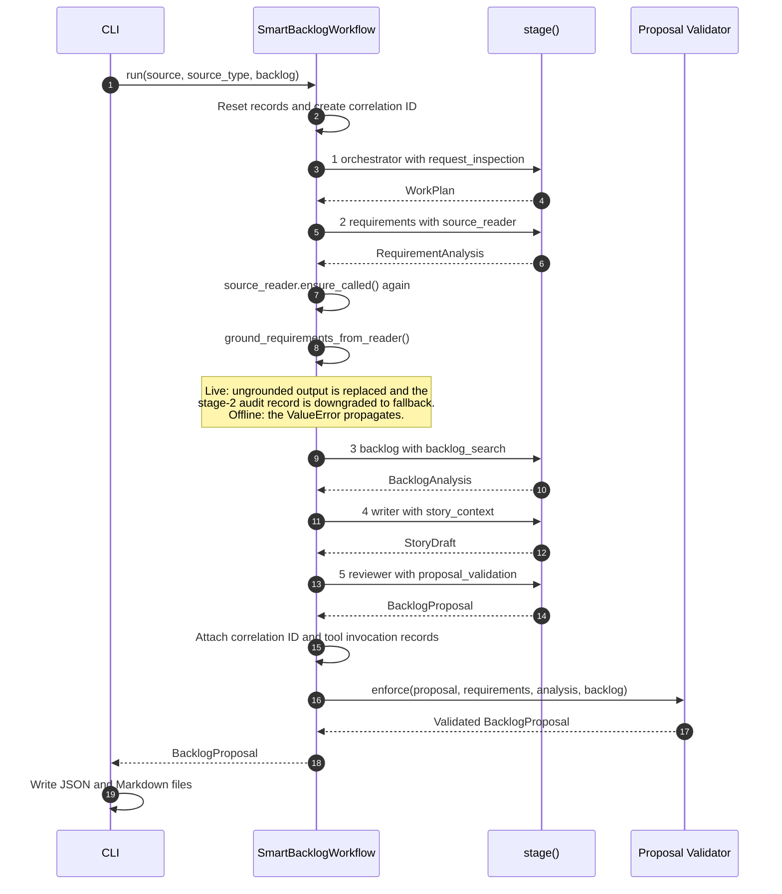
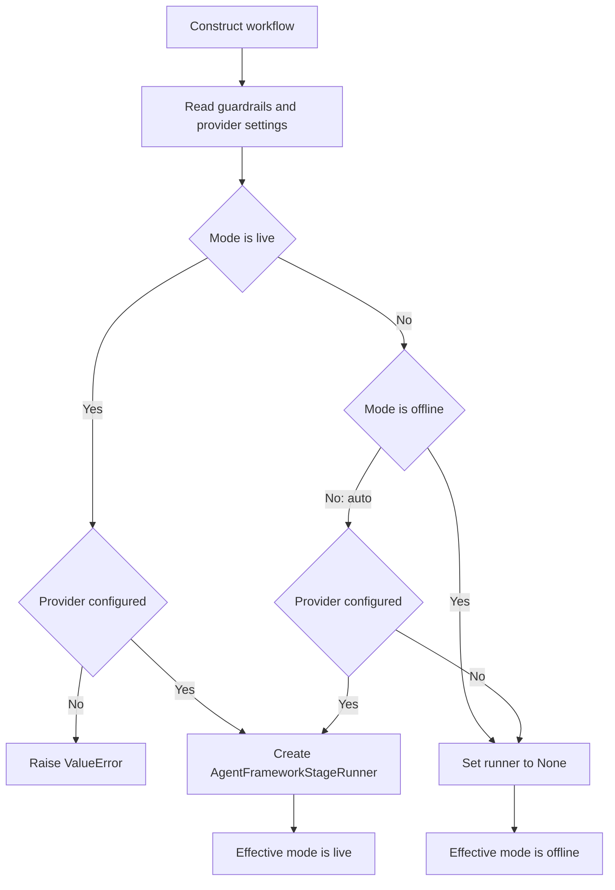
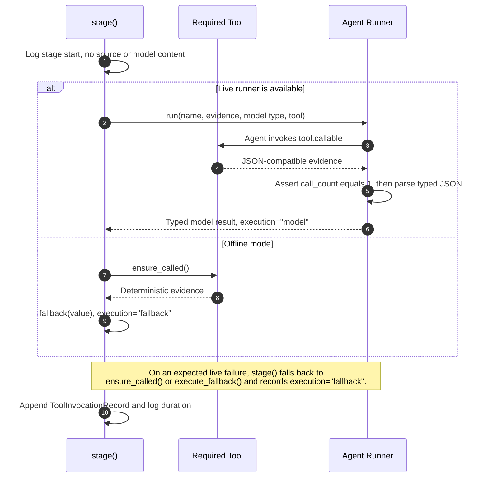
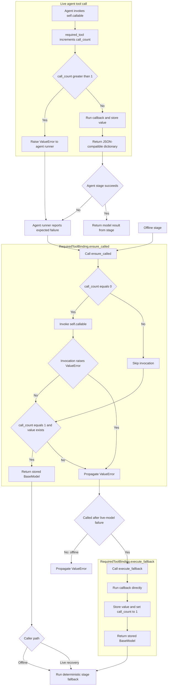

## Purpose

`application/workflow.py` coordinates the conversion of source requirements
and an existing backlog into a validated `BacklogProposal`. It supports two
execution paths:

* Offline mode uses deterministic Python functions at every stage
* Live mode asks an AI agent to produce each typed result and uses the
  deterministic implementation when an expected model failure occurs

Both paths use the same evidence tools, Pydantic contracts, final guardrails,
logging, correlation identifier, and exactly-once tool-call records.

## Main types

| Python type | Responsibility | Approximate C# equivalent |
|---|---|---|
| `SmartBacklogWorkflow` | Coordinates the complete use case | Application service |
| `BacklogItem` | Represents an existing backlog item | DTO or record |
| `WorkPlan` | Describes the required processing stages | Planning DTO |
| `RequirementAnalysis` | Contains extracted requirements, grounded by a separate step | Analysis result record |
| `BacklogAnalysis` | Contains matches and requirement gaps | Analysis result record |
| `StoryDraft` | Contains generated user stories | Draft aggregate |
| `BacklogProposal` | Represents the final output | Response DTO |
| `RequiredToolBinding` | Wraps and tracks one callback | Delegate wrapper |
| `AgentFrameworkStageRunner` | Invokes an AI agent in live mode | AI service adapter |

The Pydantic models act like C# records combined with runtime schema
validation. Calls such as `SourceReaderOutput.model_validate(value)` are
comparable to deserializing data into a C# model and validating its required
fields. The workflow validates three tool output contracts this way —
`RequestInspectionOutput`, `SourceReaderOutput`, and `BacklogSearchOutput` — and
constructs the stage result models such as `WorkPlan` directly. Live model
output is validated instead by `model_validate_json()` inside the agent runner.

## End-to-end sequence

`run()` issues five explicit `stage()` calls in a fixed order. It is not a
loop, and stage 2 is followed by a separate grounding step before stage 3
begins.



Every one of those five calls follows the same internal path, shown under
[The stage method](#the-stage-method).

## Execution mode selection

The constructor reads guardrail settings and provider configuration. Its mode
selection can be represented as follows:



`auto` therefore means live execution when provider settings are available and
offline execution otherwise. Explicit `offline` mode never creates an agent
runner, even when credentials are configured.

## The run method

`run()` is the workflow's application-service entry point. In C# terms, its
signature is similar to:

```csharp
Task<BacklogProposal> RunAsync(
    string source,
    SourceType sourceType,
    IReadOnlyList<BacklogItem> backlog);
```

### Initialize request state

The method clears records left by a previous invocation, creates a UUID
correlation identifier, starts a timer, and logs bounded metadata. Source text
and model content are not included in these process log messages.

### Stage 1: inspect the request

`RequestInspectionTool.inspect()` receives the source type and backlog count.
It classifies the request, reports whether a backlog is available, and returns
the four downstream stage names: `requirements`, `backlog`, `writer`, and
`reviewer`. The result becomes a `WorkPlan`.

The returned stage list does not drive control flow. The five `stage()` calls
are hardcoded in `run()`, and `plan.stages` is used only as recorded evidence
that is passed forward into the requirements stage.

The callback:

```python
lambda: RequestInspectionTool().inspect(source_type, len(backlog))
```

is comparable to this C# delegate:

```csharp
() => new RequestInspectionTool().Inspect(sourceType, backlog.Count)
```

The lambda stores work to execute later. Creating the lambda does not call the
tool.

### Stage 2: extract grounded requirements

`SourceReaderTool.read()` divides the source into one evidence section per
non-blank line. It recognizes the `[[PDF_PAGE:n]]` markers that the CLI loader
inserts when reading a PDF, and records the location
as either `PDF page n` or `Text block n`, and it raises `ValueError` when the
source yields no readable sections. The requirements stage returns
`RequirementAnalysis`.

Offline execution calls `deterministic_requirements_from_reader()`. It splits
the source into candidate statements, selects requirement-like statements,
deduplicates them, applies configured limits, and assigns deterministic
categories and priorities.

After the stage returns, `run()` calls `source_tool.ensure_called()` a second
time to obtain the reader evidence. Because the binding caches its value, this
does not re-execute the tool or change `call_count`.

`ground_requirements_from_reader()` then checks that every requirement
statement occurs in authoritative source evidence. In offline mode, an
ungrounded statement raises `ValueError`. In live mode, the workflow logs
`status=grounding_failed`, replaces ungrounded model output with deterministic
requirements, and rewrites the audit record that stage 2 already appended:

```python
self.tool_invocations[-1].execution = "fallback"
```

A stage that completed as `execution="model"` can therefore be downgraded to
`fallback` after the fact, so the final audit trail reflects which output was
actually kept rather than which path first succeeded.

### Stage 3: compare the backlog

`BacklogSearchTool.search()` searches existing items for every requirement.
The stage produces `BacklogAnalysis`, which contains:

* Related or duplicate backlog matches
* Requirement identifiers with no match
* A recommendation to reuse or extend matching work

The search tool scores each backlog item by token overlap and returns at most
five candidates per requirement, keeping only scores of at least `0.15`.
Requirements with no surviving candidate are reported in
`no_match_requirement_ids`.

`deterministic_backlog_from_search()` then selects the candidate with the
highest relevance score per requirement, giving three bands:

| Relevance score | Relationship | Recommended action |
|---|---|---|
| `>= 0.30` | `duplicate` | `reuse_existing` |
| `0.15` to below `0.30` | `related` | `extend_existing` |
| below `0.15` | No candidate returned | Requirement becomes a gap |

### Stage 4: write stories

`StoryContextTool.assemble()` combines requirement evidence with backlog
relationships. The writer stage returns `StoryDraft`.

`deterministic_stories()` creates one story per requirement. Each story includes
a title, description, two acceptance criteria, priority, category, requirement
traceability, backlog relationships, and one of these actions:

* `reuse_existing` when a duplicate exists
* `extend_existing` when related work exists
* `create_new` when no match exists

### Stage 5: review the proposal

`ProposalValidationTool.review_draft()` supplies deterministic validation
evidence to the reviewer. The stage returns `BacklogProposal`.

`review_draft()` assembles a provisional proposal and validates it with
`require_tool_audit=False`, because the workflow has not yet attached the tool
invocation records at this point. The final `enforce()` call runs the same
checks with the tool audit enabled.

The offline reviewer calls `deterministic_review()`. It removes stories with
duplicate titles and ensures each retained story has at least two acceptance
criteria. The proposal remains approval-gated.

### Enforce final guardrails

The method adds the correlation identifier and tool invocation records to the
proposal. `validator.enforce()` then verifies the complete proposal against the
requirements, backlog analysis, and existing backlog.

If final enforcement succeeds, `run()` logs summary metrics and returns the
validated proposal. Offline mode surfaces a `ProposalGuardrailError` instead of
retrying the same deterministic path.

If AI output fails final enforcement in live mode, the method rebuilds the
complete proposal deterministically:

1. `deterministic_requirements(source, settings)` re-extracts requirements from
   the raw source rather than from reader sections, so requirements produced on
   this path carry no `source_locations`.
2. `deterministic_backlog()`, `deterministic_stories()`, and
   `deterministic_review()` rebuild the analysis, draft, and proposal.
3. The review notes gain `AI output failed guardrails; a deterministic
   validated proposal was used.`, which is visible in both output files.
4. The original correlation identifier and tool invocation records are
   reattached, and `validator.enforce()` validates the rebuilt proposal.
   Completion is logged as `execution=validated_fallback`.

There is no second retry. If the rebuilt proposal also fails, the
`ProposalGuardrailError` from that final `enforce()` call propagates to the CLI.

### What enforcement demands of a model-authored proposal

`validate()` compares most of the reviewer's proposal against the confirmed
analysis by equality, not by meaning, which sets a high bar for a model-authored
result:

| Proposal field | Requirement |
|---|---|
| `requirements` | `model_dump()` equality with the confirmed requirements, **including `source_locations`** |
| `key_requirements` | Set equality with the confirmed requirement statements |
| `assumptions` | List equality with `requirements.assumptions` |
| `summary` | Free — may be rewritten |
| `stories` | May be edited, but must satisfy every story-level check |

Perturbing a passing deterministic proposal confirms each row: emptying
`source_locations`, rewording one requirement statement, rewording one
`key_requirements` entry, or adding an assumption each turns `passed` into
`failed`, while rewriting `summary` alone still passes.

The reviewer agent is therefore only free to improve the summary and the stories.
Any paraphrase of a requirement statement is rejected. This is why the reviewer
stage's model output is so often discarded — the earlier live run failed on
exactly this check, with `Key requirements do not exactly match the confirmed
requirements.`

### Telling the two live outcomes apart

Live mode does not always end in a rebuild. Both observed outcomes are visible in
the output file without reading the log:

| Signal | Model proposal accepted, or all stages fell back | Model proposal rejected, rebuilt |
|---|---|---|
| Completion log | `execution=live` | `execution=validated_fallback` |
| Guardrail review note | Absent | Present |
| `source_locations` | Populated | Empty |

The rebuild reattaches the *original* `tool_invocations`, so per-stage
`execution="model"` records survive into a proposal whose content was produced
deterministically. A record of `execution="model"` therefore means only that the
model produced that stage's intermediate result, not that the model's proposal
was the one returned. The guardrail review note, not the tool records, is the
reliable signal.

Both shapes have been reproduced. All six live proposals currently present under
`output/live/`, plus a fresh live run of
`data/proposed_modernization_extension.txt`, land in the right-hand column, and
that live output is identical field by field to an offline run of the same input
except for `source_locations`. A live run in which every stage times out lands in
the left-hand column: the content is fully deterministic, so enforcement passes
first time, the completion line reads `execution=live`, no guardrail note is
added, and `source_locations` are populated because stage 2 fell back to the
reader evidence rather than to raw source.

## The stage method

`stage()` centralizes behavior shared by all five stages:

1. Resolve the stage sequence number and start a timer.
2. Log the stage start without logging source or model content.
3. Execute the live agent or deterministic fallback.
4. Record the tool name, call count, execution type, and correlation ID.
5. Log completion metrics and return the typed result.

Its key branch is:

```python
if self.runner:
    result = await self.runner.run(...)
else:
    result = fallback(tool.ensure_called())
```

The approximate C# structure is:

```csharp
T result;

if (runner is not null)
{
    result = await runner.RunAsync<T>(name, evidence, tool);
}
else
{
    result = fallback(tool.EnsureCalled());
}
```

Expected live-agent failures are caught as `TimeoutError`, `ValueError`,
`ValidationError`, and `RuntimeError`. When one occurs, `stage()` logs
`status=model_failed`, obtains the tool value, and executes the deterministic
fallback. Unexpected exceptions are not swallowed.

Two of those failure kinds have been exercised against a live provider:

* **Timeout.** Running with `AGENT_TIMEOUT_SECONDS=1`, against a provider whose
  stages normally take two to nine seconds, makes all five stages log
  `status=model_failed error_type=TimeoutError`. Each falls back cleanly with
  `call_count=1`, and the run completes successfully because the resulting
  content is fully deterministic.
* **Tool called twice.** The binding rejects the second call, Agent Framework
  reports that tool error to the model rather than aborting, and the runner's
  own post-hoc check then fails because `call_count` is `2`. `ensure_called()`
  cannot recover that state, so `stage()` routes it to `execute_fallback()`,
  which resets `call_count` to `1`. The recorded audit row is
  `call_count=1 execution=fallback`, which is what keeps the exactly-once
  guardrail satisfied after a malformed model interaction.

The shared path inside every `stage()` call is:



## Live agent execution

`AgentFrameworkStageRunner.run()` constructs one Microsoft Agent Framework
`Agent` per stage and constrains its output in four ways:

* The target Pydantic schema is injected into the prompt through
  `build_stage_prompt(stage, model_type.model_json_schema(), evidence)`
* The single required tool is passed as `tools=[tool.callable]` with options
  `allow_multiple_tool_calls: False` and `store: False`
* The call is wrapped in `asyncio.wait_for` using
  `settings.agent_timeout_seconds`, so a slow model raises `TimeoutError`
* `parse_json_model()` strips any Markdown code fence, extracts the outermost
  JSON object, and validates it with `model_type.model_validate_json()`

The runner also enforces the exactly-once contract itself, after the agent has
finished:

```python
if tool.call_count != 1:
    raise ValueError(
        f"{tool.name} was not called exactly once by {stage} agent"
    )
```

This assertion, not the binding, is what catches an agent that skipped its
required tool entirely. The binding only raises on a second call, so a
`call_count` of zero would otherwise pass unnoticed. Either way the resulting
`ValueError` routes `stage()` into the deterministic fallback.

A skipped tool is visible in the log without a debugger. Agent Framework emits
its own `INFO agent_framework Function name: <tool>` line each time a tool
actually runs, so the stage that reports `status=model_failed
error_type=ValueError` while having no matching `Function name:` line is one
where the model answered without calling its tool. This is not hypothetical: on
a live `gpt-4o-mini` run of `data/proposed_modernization_extension.txt`, four
stages logged their tool call and the writer stage logged none, producing
exactly that pairing. The subsequent `ensure_called()` then invoked the tool for
the first time, which is why the audit record still shows `call_count=1`
alongside `execution=fallback`.

## Required tool bindings

Each stage constructs a `RequiredToolBinding` with a name, description, and
zero-argument callback. The wrapper exposes that callback to the agent and
tracks its execution.

The agent can invoke `self.callable` directly. Offline execution calls
`ensure_called()`. After an expected live-model failure, `stage()` also calls
`ensure_called()`, but catches its `ValueError` and routes that failure to
`execute_fallback()`:



In C# terms, the callback is a `Func<BaseModel>`, while `self.callable` is the
wrapped delegate that adds exactly-once tracking and JSON-compatible output.
`execute_fallback()` deliberately bypasses the wrapped callable and normalizes
the stored state to one completed invocation.

The diagram shows the recovery path succeeding, which is the case whenever the
earlier failure came from call sequencing rather than from the callback itself.
Because `execute_fallback()` re-runs the same callback, a callback that raises on
its own inputs — for example `SourceReaderTool.read()` on a source with no
readable sections — raises again, and that `ValueError` leaves `stage()`
uncaught and reaches the CLI error handler.

## Process log vocabulary

All process records are emitted on the `smart_backlog` logger and carry the
correlation identifier. Source text and model content never appear in them.

| Emitted by | Level | Shape |
|---|---|---|
| `run()` start | INFO | `workflow=smart_backlog status=started mode=<mode> source_type=<t> source_chars=<n> backlog_items=<n>` |
| `stage()` start | INFO | `step=<n>/5 agent=<Agent Name> tool=<tool> status=started mode=<mode>` |
| `stage()` model failure | WARNING | `step=<n>/5 ... status=model_failed error_type=<Type>; using fallback` |
| Grounding failure | WARNING | `step=2/5 ... status=grounding_failed error_type=ValueError; using fallback` |
| `stage()` completion | INFO | `status=completed execution=<model or fallback> call_count=<n> duration_ms=<n> <summary>` |
| `run()` completion | INFO | `workflow=smart_backlog status=completed execution=<mode> duration_ms=<n> requirements=<n> stories=<n> tool_records=<n>` |
| `run()` completion after rebuild | INFO | `... status=completed execution=validated_fallback ...` |

The `execution=` key is overloaded, which is easy to misread when scanning logs:

* On a `step=<n>/5` stage line it holds `model` or `fallback`
* On a `workflow=smart_backlog` completion line it holds the effective *mode* —
  `offline` or `live` — except on the rebuild path, where it holds
  `validated_fallback`

So a successful offline run ends with `execution=offline`, which is a mode and
not one of the two `ToolInvocationRecord.execution` values.

The trailing `<summary>` comes from `stage_result_summary()` and is a
content-free metric string whose keys vary by result type, for example
`planned_stages=4 backlog_items=1` for `WorkPlan` or
`stories=9 acceptance_criteria=18` for `StoryDraft`.

## Deterministic helper functions

| Function | Behavior |
|---|---|
| `priority_for()` | Assigns High, Medium, or Low from configured keywords |
| `category_for()` | Maps requirement text to an engineering category |
| `deterministic_requirements()` | Extracts bounded requirements from source text |
| `deterministic_requirements_from_reader()` | Adds evidence locations to extracted requirements |
| `ground_requirements_from_reader()` | Rejects requirements absent from source evidence |
| `deterministic_backlog_from_search()` | Converts search candidates into matches and gaps |
| `deterministic_backlog()` | Runs search and deterministic match conversion |
| `deterministic_stories()` | Creates one traceable story per requirement |
| `deterministic_review()` | Deduplicates and completes the proposal structure |
| `stage_result_summary()` | Produces content-free metrics for process logs |

## Offline call path

For the command-line option `--mode offline`, `self.runner` is always `None`.
Every stage therefore follows this path:

```text
RequiredToolBinding.ensure_called()
  -> execute the stage's deterministic evidence tool once
  -> return its Pydantic model
  -> execute the stage's fallback function
  -> record execution="fallback"
```

The tool always runs, but only the first three stages consume its result. The
writer and reviewer fallbacks are declared as `lambda _value: ...` and discard
the tool output, recomputing from `requirements`, `analysis`, and `draft`
instead:

| Stage | Tool | Fallback uses the tool result |
|---|---|---|
| 1 orchestrator | `request_inspection` | Yes, for `required_stages` |
| 2 requirements | `source_reader` | Yes, as the source of evidence sections |
| 3 backlog | `backlog_search` | Yes, as the candidate list |
| 4 writer | `story_context` | No, the value is discarded |
| 5 reviewer | `proposal_validation` | No, the value is discarded |

For stages 4 and 5 the tool call therefore exists to satisfy the exactly-once
audit contract that `ProposalValidationTool._validate_tool_invocations()`
enforces, not to feed the deterministic computation.

The word `fallback` in the audit record does not indicate an offline error. It
identifies the deterministic implementation as opposed to model execution.

## Output boundary

`run()` returns a `BacklogProposal`; it does not write files. The CLI owns the
output boundary and serializes the proposal to:

* `backlog_proposal.json` as the canonical structured result
* `backlog_proposal.md` as the human-readable review document

This separation keeps workflow logic independent from command-line file output
and makes the application service directly testable.

## Useful debugging points

Set breakpoints at these statements to observe the main transitions:

* [Start of SmartBacklogWorkflow.run()](../../src/smart_backlog_assistant/application/workflow.py#L497)
    to inspect normalized inputs
* [The runner branch in stage()](../../src/smart_backlog_assistant/application/workflow.py#L439)
    to confirm the effective execution mode
* [The deterministic fallback call](../../src/smart_backlog_assistant/application/workflow.py#L466)
    to inspect each offline stage
* [Requirement grounding](../../src/smart_backlog_assistant/application/workflow.py#L560)
    to inspect source evidence validation
* [Backlog analysis](../../src/smart_backlog_assistant/application/workflow.py#L585)
    to inspect matches and gaps
* [Final guardrail enforcement](../../src/smart_backlog_assistant/application/workflow.py#L642)
    to inspect the validated result

Watch `name`, `tool.call_count`, `self.mode`, `requirements`, `analysis`,
`draft`, and `proposal` while stepping through the workflow.